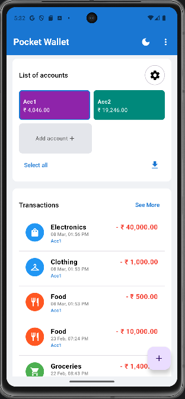
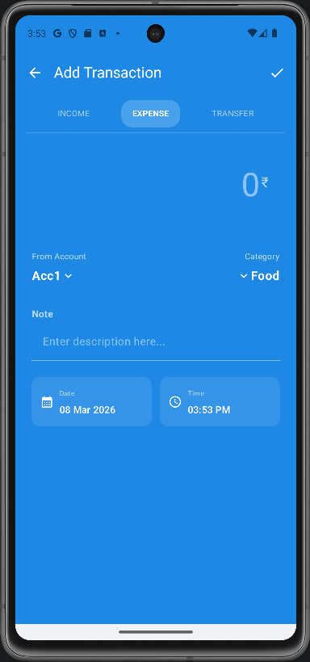
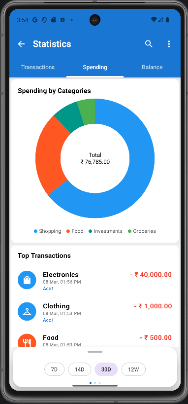

# Pocket Wallet

Pocket Wallet is a simple and modern Android expense tracking application that helps users manage their finances easily.  
It allows users to create accounts, track income and expenses, and view spending summaries in a clean and intuitive interface.

---

## Features

- Create and manage multiple accounts
- Add income and expense transactions
- Categorize transactions
- View account balances
- Transaction history tracking
- Category wise spending summaries
- Modern UI built with Jetpack Compose
- Local data storage using Room database

---
## Tech Stack

- Kotlin
- Jetpack Compose
- Room Database
- MVVM Architecture
- Coroutines and Flow
- Material Design

---

## Screenshots

  
  
  

---

## Installation

1. Clone the repository
   git clone https://github.com/ajaysolanki52gg/pocket_wallet.git

2. Open the project in Android Studio

3. Sync Gradle and run the app on an emulator or device
---
## APK

You can download the latest APK from the Releases section of this repository.

---

## Contributing

Contributions are welcome. Feel free to fork the repository and submit a pull request.

---

## License

This project is open source and available under the MIT License.

---

## Note

This app was originally built for my personal use to track expenses and manage accounts.  
If you find it useful, feel free to use it, modify it, or improve it.

The project was built with the help of AI tools during development.  
Contributions, improvements, and suggestions are always welcome.
